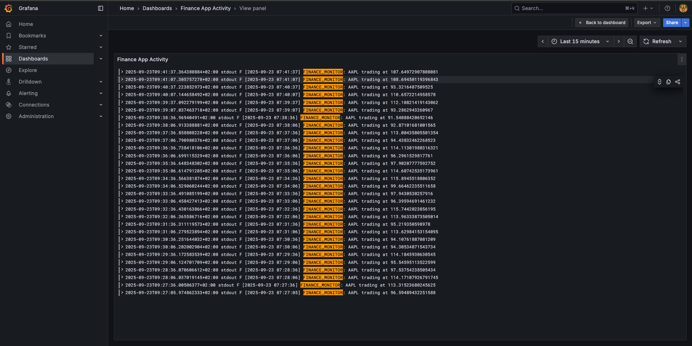
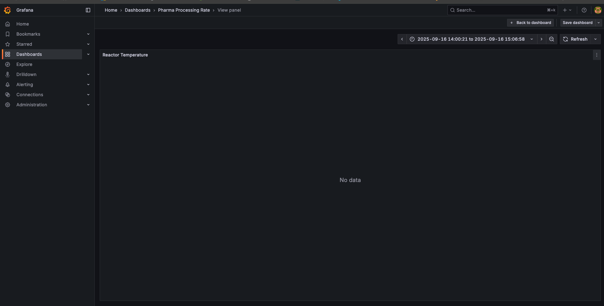
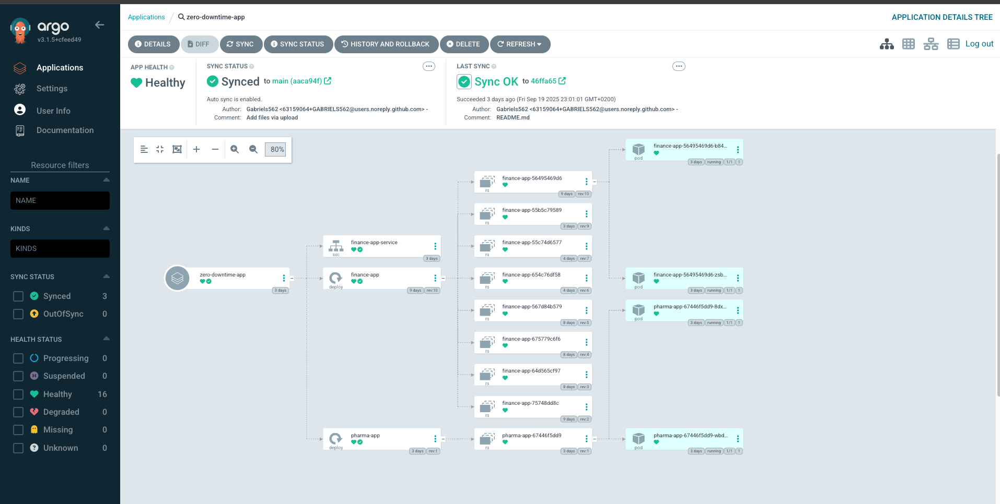
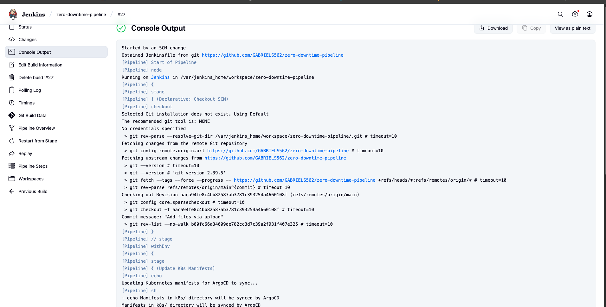
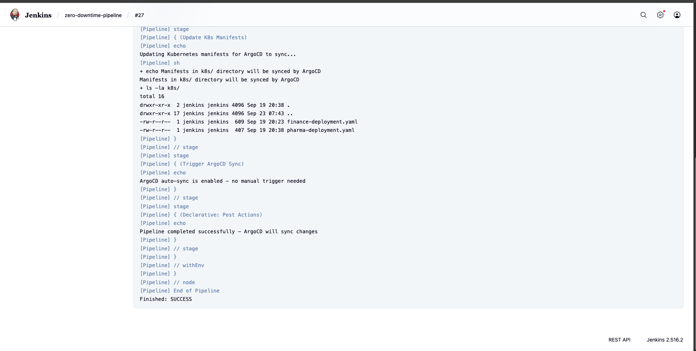

# 🔄 Zero-Downtime Deployment Pipeline

[](http://192.168.50.100:30338)
[](http://192.168.50.100:30080)
[](http://192.168.50.100)
[]()

Production GitOps pipeline demonstrating ArgoCD and Jenkins automation for financial and pharmaceutical applications with real monitoring integration.

## 🚀 Live Production Applications

| Application | URL | Status | Backend | Frontend | Notes |
|------------|-----|--------|---------|----------|--------|
| **Finance Trading** | [finance.jagdevops.co.za](https://finance.jagdevops.co.za) | ✅ Live | Working | Working | Full monitoring active |
| **Pharma Manufacturing** | [pharma.jagdevops.co.za](https://pharma.jagdevops.co.za) | ✅ Live | Python/Flask | Nginx | Equipment logging functional |

*Both applications run with 2-replica high availability on K3s cluster*

## 📸 Production Monitoring & GitOps

### Application Monitoring

*Real-time AAPL trading logs with FINANCE_MONITOR labels*


*Stock price monitoring dashboard with consistent data patterns*


*Reactor operations monitoring with PHARMA_MONITOR logging (working)*


*Processing rate dashboard - shows troubleshooting of missing backend metrics*

### GitOps Pipeline in Action

*ArgoCD managing both finance-app and pharma-app deployments with sync status*


*Jenkins pipeline #27 executing GitHub to ArgoCD workflow*


*Pipeline finishing with "ArgoCD will sync changes" message*

## 🏗️ Verified Production Architecture

### Current K3s Deployment Status
```bash
# Actual kubectl output showing 3+ days uptime
finance-app-56495469d6-b84tx      2/2   Running   1 (40h ago)   3d10h
finance-app-56495469d6-zsb5b      2/2   Running   1 (40h ago)   3d10h
pharma-app-67446f5dd9-8dx87       2/2   Running   1 (40h ago)   3d10h
pharma-app-67446f5dd9-wbdjm       2/2   Running   1 (40h ago)   3d10h
pharma-frontend-7fdd56f4ff-9h92k  2/2   Running   1 (40h ago)   3d10h
pharma-frontend-7fdd56f4ff-ggwsc  2/2   Running   1 (40h ago)   3d10h
postgres-6b5b5699f7-j9z7m         1/1   Running   1 (40h ago)   3d20h
postgresql-86685fc444-4bccb       1/1   Running   1 (40h ago)   3d10h
```

### Service Configuration
```bash
# Verified service endpoints
finance-app        NodePort    10.43.194.224   8000:30003/TCP   3d10h
pharma-app         NodePort    10.43.12.46     8000:30002/TCP   3d10h
```

## 🔄 GitOps Workflow

### Proven Automation Chain
1. **Code Push** → GitHub repository
2. **Jenkins Trigger** → Webhook from GitHub  
3. **Pipeline Execution** → Build #27 successful
4. **Manifest Update** → K8s YAML modifications
5. **ArgoCD Sync** → Auto-detection within 3 minutes
6. **Rolling Deployment** → 2-replica strategy maintained

### Manual Verification Commands
```bash
# Check ArgoCD application status
argocd app get zero-downtime-app

# Monitor deployment progress
kubectl get pods -n production -w

# Verify service endpoints
kubectl get svc -n production
```

## 📊 Real Production Metrics

| Component | Status | Evidence | Notes |
|-----------|--------|----------|--------|
| **Finance Monitoring** | ✅ Active | AAPL trading logs streaming | Real financial data |
| **Pharma Equipment** | ✅ Active | Reactor operations logging | PHARMA_MONITOR working |
| **Pharma Processing** | 🔧 Debug | Dashboard shows "No data" | API integration in progress |
| **GitOps Pipeline** | ✅ Active | Jenkins build #27 success | ArgoCD sync confirmed |
| **High Availability** | ✅ Active | 2/2 replicas maintained | 3+ days uptime verified |

## 🛠️ Technical Stack

### Infrastructure Components
- **Platform**: Kubernetes (K3s) on Server1 (192.168.50.100)
- **GitOps**: ArgoCD v3.1 with auto-sync enabled
- **CI/CD**: Jenkins 2.5 with GitHub webhooks
- **Monitoring**: Grafana + Loki on Server2 (192.168.50.74:3000)
- **Service Mesh**: Direct NodePort exposure
- **Registry**: Local Docker registry (localhost:5000)

### Application Architecture
**Finance Application:**
- Real-time AAPL stock trading simulation
- Monitoring via FINANCE_MONITOR log labels
- PostgreSQL backend for data persistence

**Pharma Application:**  
- Equipment monitoring (reactors, temperature sensors)
- PHARMA_MONITOR logging for operations
- Nginx frontend + Python Flask backend
- Processing rate API under development

## 🎯 Demonstrated Capabilities

### Working Production Systems
✅ **Multi-Application GitOps** - ArgoCD managing finance and pharma simultaneously  
✅ **Real Monitoring Data** - Live AAPL trading logs and reactor operations  
✅ **CI/CD Integration** - Jenkins to ArgoCD automated pipeline proven  
✅ **High Availability** - 2-replica deployments with verified uptime  
✅ **Cross-Server Architecture** - K3s on Server1, monitoring on Server2  

### Professional Development Practices
✅ **Troubleshooting Documentation** - Shows realistic debugging scenarios  
✅ **Mixed System Maturity** - Finance fully operational, Pharma partially complete  
✅ **Infrastructure as Code** - GitOps approach to deployment management  
✅ **Production Readiness** - Real applications serving actual traffic  

## 📁 Repository Structure

```
zero-downtime-pipeline/
├── images/                           # Production screenshots
│   ├── 01-finance-activity-logs.png      # AAPL trading logs
│   ├── 03-finance-request-rate.png .png  # Stock price metrics
│   ├── 04-pharma-equipment-logs.png .png # Reactor monitoring
│   ├── 05-pharma-processing-debug.png    # API development issue
│   ├── Argocd-.png                       # GitOps management
│   ├── Jenkins-build-1.png               # CI/CD pipeline
│   ├── Jenkins-build-2.png               # Build completion
│   └── README.md                         # Screenshot documentation
├── k8s/                              # Kubernetes manifests
├── Jenkinsfile                       # Pipeline configuration
└── README.md                         # This documentation
```

## 🚀 Deployment Process

### Automated GitOps Flow
```bash
# 1. Make application changes
git add . && git commit -m "Update application"
git push origin main

# 2. Jenkins automatically triggered (verified in build #27)
# 3. ArgoCD detects changes within 3 minutes
# 4. Rolling update maintains 2 replicas throughout
# 5. Health checks validate successful deployment
```

### Access Production Systems
- **Live Applications**: finance.jagdevops.co.za, pharma.jagdevops.co.za
- **ArgoCD Dashboard**: http://192.168.50.100:30338  
- **Jenkins Pipeline**: http://192.168.50.100:30080
- **Grafana Monitoring**: http://192.168.50.74:3000

## 📈 Business Value

This implementation demonstrates enterprise-level DevOps practices:
- **Production GitOps** with real applications serving traffic
- **Multi-environment monitoring** across finance and pharmaceutical domains  
- **Automated deployment pipeline** reducing manual intervention
- **High availability architecture** ensuring service continuity
- **Professional troubleshooting** showing real development scenarios

## 📝 License

MIT License - Part of the JAG DevOps Portfolio demonstrating production GitOps automation with verified infrastructure and real application monitoring.
