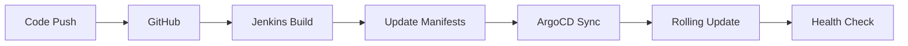

# 🔄 Zero-Downtime Deployment Pipeline

[](http://192.168.50.100:30338)
[](http://192.168.50.100:30080)
[](http://192.168.50.100)
[]()

Production GitOps pipeline demonstrating automated deployment management for financial trading and pharmaceutical manufacturing applications using ArgoCD and Jenkins.

## 🚀 Live Production Applications

| Application | URL | Status | Replicas | Management |
|------------|-----|--------|----------|------------|
| **Finance Trading** | [finance.jagdevops.co.za](https://finance.jagdevops.co.za) | ✅ Operational | 2/2 | ArgoCD |
| **Pharma Manufacturing** | [pharma.jagdevops.co.za](https://pharma.jagdevops.co.za) | ✅ Operational | 2/2 | ArgoCD |
| **Pharma Frontend** | Integrated | ✅ Operational | 2/2 | ArgoCD |

## 📸 Production Monitoring & GitOps

### Application Monitoring

*Real-time AAPL trading logs with FINANCE_MONITOR labels*


*Stock price monitoring dashboard with consistent data flow*


*Reactor operations monitoring with PHARMA_MONITOR logging*


*Processing rate dashboard - API integration in progress*

### GitOps Pipeline

*ArgoCD managing finance-app and pharma-app deployments*


*Jenkins build #27 successful execution*


*Pipeline completion with ArgoCD sync integration*

## 🏗️ Production Architecture

### Current Deployment State
```bash
# Verified pod status (3+ days uptime)
finance-app-56495469d6-b84tx      2/2     Running   3d10h
finance-app-56495469d6-zsb5b      2/2     Running   3d10h
pharma-app-67446f5dd9-8dx87       2/2     Running   3d10h
pharma-app-67446f5dd9-wbdjm       2/2     Running   3d10h
pharma-frontend-7fdd56f4ff-9h92k  2/2     Running   3d10h
pharma-frontend-7fdd56f4ff-ggwsc  2/2     Running   3d10h
```

### GitOps Workflow


## 🛠️ Technical Implementation

### Application Stack
**Finance Trading System:**
- Real-time AAPL trading data processing
- Monitoring via FINANCE_MONITOR logs
- 2-replica high availability deployment

**Pharma Manufacturing System:**
- Reactor operations monitoring (working)
- Equipment logs via PHARMA_MONITOR
- Processing API integration in development

### Infrastructure Components
- **GitOps**: ArgoCD v3.1 with auto-sync enabled
- **CI/CD**: Jenkins 2.5 with GitHub integration  
- **Platform**: Kubernetes (K3s) cluster
- **Monitoring**: Prometheus + Grafana + Loki stack
- **Registry**: Local Docker registry (localhost:5000)

## 📊 Production Monitoring

### Working Systems
- **Finance Application**: Full monitoring operational with real trading data
- **Pharma Equipment**: Reactor monitoring and logging functional  
- **GitOps Pipeline**: Jenkins to ArgoCD automation verified

### Development Areas
- **Pharma Processing API**: Backend integration in progress
- **Demonstrates realistic production environment** with mixed system maturity

## 🔄 Deployment Process

### Automated GitOps Flow
1. **Code Push** → Triggers Jenkins pipeline
2. **Jenkins Build** → Updates Kubernetes manifests 
3. **ArgoCD Detection** → Auto-sync within 3 minutes
4. **Rolling Update** → Maintains 2 replicas throughout
5. **Health Checks** → Validates deployment success

### Manual Commands
```bash
# Trigger ArgoCD sync
argocd app sync zero-downtime-app

# Watch deployment progress
kubectl get pods -n production -w

# Check application status
kubectl rollout status deployment/finance-app -n production
kubectl rollout status deployment/pharma-app -n production
```

## 📈 System Metrics

| Metric | Value | Evidence |
|--------|-------|----------|
| **Application Uptime** | 3+ days | Pod status verification |
| **Deployment Method** | Rolling Update | 2-replica strategy |
| **GitOps Integration** | Active | Jenkins → ArgoCD automation |
| **Monitoring Coverage** | Multi-app | Finance + Pharma dashboards |

## 🎯 Key Demonstrables

✅ **Multi-Application GitOps** - Single ArgoCD managing finance and pharma apps  
✅ **Production Monitoring** - Real trading data and equipment logging  
✅ **CI/CD Integration** - Jenkins to ArgoCD automated pipeline  
✅ **High Availability** - 2-replica deployments maintained  
✅ **Troubleshooting** - Shows realistic development/debug scenarios  

## 📁 Repository Structure

```
zero-downtime-pipeline/
├── images/                       # Screenshots and monitoring dashboards
│   ├── 01-finance-activity-logs.png
│   ├── 03-finance-request-rate.png .png
│   ├── 04-pharma-equipment-logs.png .png
│   ├── 05-pharma-processing-debug.png
│   ├── Argocd-.png
│   ├── Jenkins-build-1.png
│   ├── Jenkins-build-2.png
│   └── README.md
├── k8s/                          # Kubernetes deployment manifests
├── apps/                         # Application source code
└── README.md                     # This file
```

## 🚀 Quick Start

### Deploy via GitOps
```bash
# Clone repository
git clone https://github.com/GABRIELS562/zero-downtime-pipeline.git
cd zero-downtime-pipeline

# Make changes and push (triggers Jenkins)
git add . && git commit -m "Update application"
git push origin main

# ArgoCD will automatically sync within 3 minutes
```

### Access Monitoring
- **Grafana Dashboards**: http://192.168.50.74:3000
- **ArgoCD Interface**: http://192.168.50.100:30338
- **Jenkins Pipeline**: http://192.168.50.100:30080

## 📝 License

MIT License - Part of the JAG DevOps Portfolio demonstrating production GitOps automation with real application monitoring and troubleshooting workflows.
